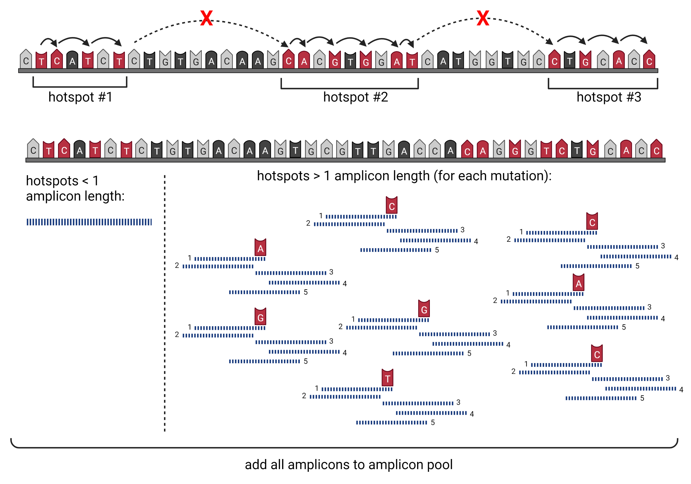
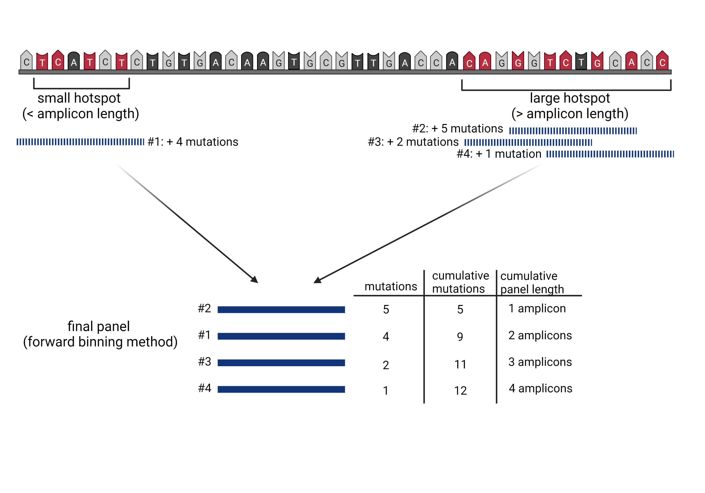
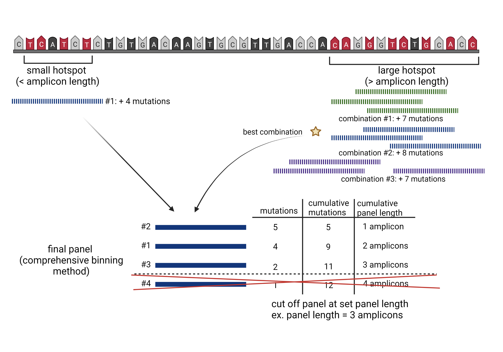

## Table of Contents
1. [Introduction](#introduction)
2. [Installation & Setup](#load_package)
3. [Dataset Formatting](#format_data)
4. [Algorithm](#algorithm)
  1. [Generation of Amplicon Pool](#amp_pool)
  2. [Forward Binning](fw_bin)
  3. [Comprehensive Binning](comp_bin)
  4. [Choosing between Forward and Comprehensive Binning Methods](#choose_method)
5. [Summary of Output Data](#output_sum)
  


## Introduction to seq.hotSPOT <a name="introduction"/>

seq.hotSPOT provides a resource for designing effective sequencing panels to help improve mutation capture efficacy for ultradeep sequencing projects. Using SNV datasets, this package designs custom panels for any tissue of interest and identify the genomic regions likely to contain the most mutations. Establishing efficient targeted sequencing panels can allow researchers to study mutation burden in tissues at high depth without the economic burden of whole-exome or whole-genome sequencing. This tool was developed to make high-depth sequencing panels to study low-frequency clonal mutations in clinically normal and cancerous tissues.

## Installation & Setup <a name="load_package"/>


``` {r install package}
if (!require("BiocManager", quietly = TRUE))
  install.packages("BiocManager")                                                                      
BiocManager::install("seq.hotSPOT")
```

``` {r load library}
library(seq.hotSPOT)
```

## Formatting of Input Data <a name = "format_data"/>

The mutation dataset should include two columns containing the chromosome and genomic position of each mutation. The columns should be named "chr" and "pos" respectively. Optionally, the gene names for each mutation may be included under a column named "gene".

Loading example data:
``` {r load data}
data("mutation_data")
```


## Overview of hotSPOT Algorithm <a name = "algorithm"/>

### Generation of Amplicon Pool <a name = "amp_pool"/>

This algorithm searches the mutational dataset (input) for mutational hotspot regions on each chromosome:

1.	Starting at the mutation with the lowest chromosomal position (primary mutation), using a modified rank and recovery system, the algorithm searches for the closest neighboring mutation.

2.	If the neighboring mutation is less than one amplicon, in distance, away from the primary mutation, the neighboring mutation is included within the hotspot region.

  * This rank and recovery system is repeated, integrating mutations into the hotspot region until the neighboring mutation is greater than or equal to the length of one amplicon in distance, from the primary mutation.
  * Once neighboring mutations equal or exceed one amplicon in distance from the primary mutation, incorporation into the hotspot region, halts incorporation.

3.	For hotspots within the one amplicon range, from the lowest to highest mutation location, this area is covered by a single amplicon and added to an amplicon pool, with a unique ID.

  * The center of these single amplicons is then defined by the weighted distribution of mutations.
  
4.	For all hotspots larger than one amplicon, the algorithm examines 5 potential amplicons at each covered mutation in the hotspot:

  * one amplicon directly upstream of the primary mutation
  * one amplicon directly downstream of the primary mutation
  * one amplicon including the mutation at the end of the read and base pairs (amplicon length - 1) upstream
  * one amplicon including the mutation at the beginning of the read and base pairs (amplicon length - 1) downstream
  * one amplicon with the mutation directly in the center.

5.	All amplicons generated for each hotspot region of interest, are assigned a unique ID and added to the amplicon pool.

Running amplicon finder:
``` {r run amp finder, include = TRUE}
amps <- amp_pool(data = data, amp = 100)
```



### Forward Selection Sequencing Panel Identifier <a name = "fw_bin"/>

1.	Amplicons covering hotspots less than or equal to one amplicon in length, are added to the final sequencing panel dataset.

2.	For amplicons covering larger hotspot regions, the algorithm uses a forward selection method to determine the optimal combination of amplicons to use in the sequencing panel:

  * the algorithm first identifies the amplicon containing the highest number of mutations
  * the algorithm then identifies the next amplicon, which contains the highest number of new mutations.
  * this process continues until all mutations are covered by at least one amplicon

3.	Each of these amplicons are then added to the final sequencing panel, with their own unique IDs.

4.	All amplicons in the final sequencing panel are ranked from highest to lowest based on the number of mutations they cover.

5.	The algorithm then calculates the cumulative base-pair length and the cumulative mutations covered by each amplicon.

6.	Dependent on the desired length of the targeted panel, a cutoff may be applied to remove all amplicons which fall below a set cumulative length.

Running forward selection sequencing panel identifier
``` {r fw binning, include = TRUE}
fw_bins <- fw_hotspot(bins = amps, data = data, amp = 100, len = 1000, include_genes = TRUE)
```



### Comprehensive Selection Sequencing Panel Identifier <a name = "comp_bin"/>

1.	To conserve computational power, the forward selection sequencing panel identifier is run to determine the lowest number of mutations per amplicon (mutation frequency) that need to be included in the predetermined length sequencing panel.

  * any amplicon generated by the algorithm, which is less than this threshold value, will be removed.

2.	For the feasible exhaustive selection of amplicon combinations covering hotspot areas larger than the predefined number of amplicons in length, the algorithm breaks these large regions into multiple smaller regions.

  * the amplicons covering these regions are pulled from the amplicon pool, based on their unique IDs.

3.	The algorithm finds both the minimum number of amplicons overlap and all positions with this value and identifies the region with the longest continuous spot of minimum value.

  * the region is split at the center of this longest continuous minimum post values and continues the splitting process until all smaller regions are less than the “n” number amplicon length set by the user.
  * As this set number of amplicons decreases, the computation time required also often decreases.

4.	All amplicons contained in these bins are added back to the amplicon pool, based on a new unique ID.

5.	Amplicons covering hotspots less than or equal to one amplicon length are added to the final sequencing panel dataset.

6.	To determine the optimal combination of amplicons for each region, the number of amplicons necessary for full coverage of the bin is calculated.

7.	A list is generated of every possible combination of n, number of amplicons, needed. For each combination of amplicons:

  * amplicons that would not meet the threshold of unique mutations are filtered out, and the number of all mutations captured by these amplicons is calculated.
  * the combination of amplicons that yields the highest number of mutations is added to the final sequencing panel.

8.	All amplicons in the final sequencing panel are ranked from highest to lowest based on the number of mutations they cover.

9.	All amplicons capturing the number of mutations equal to the cutoff are further ranked to favor amplicons that have mutations closer in location to the center of the amplicon.

10.	Cumulative base-pair length and cumulative mutations covered by each amplicon are calculated.

  * Depending on the desired length of the targeted panel, a cutoff may be applied to remove all amplicons which fall below a set cumulative length.

Running comprehensive selection sequencing panel identifier
``` {r com bins, include = TRUE}
com_bins <- com_hotspot(fw_panel = fw_bins, bins = amps, data = data, 
                        amp = 100, len = 1000, size = 3, include_genes = TRUE)
```




### Choosing between Forward and Comprehensive Methods <a name = "choose_method"/>

Although the output sequencing panel from forward and comprehensive methods will in most cases be very similar, the differences in methods for capturing the optimal number of mutations vary and therefore may lead to small differences. While the comprehensive method may lead to a slight increase in mutation capture efficacy, this method is much more computationally intensive compared to the forward method. Therefore, we recommend the use of the comprehensive method for smaller mutations datasets (~500 data points or less) and the use of the forward binning for larger datasets.


## Summary of Output Data <a name="output_sum"/>

Both the forward and comprehensive methods will output a dataframe of the same format. Each row of the dataframe contains the information for an individual hotspot. The dataframe is ranked containing the most mutated hotspot at the top and continuing in descending order. The columns contain the following information:
1. Lowerbound: lowest base pair position of the hotspot
2. Upperbound: highest base pair position of the hotspot
3. Chromosome: chromosome number which the hotspot is located on
4. Mutation Count: number of mutations in input dataset which were found within the regions of this hotspot
5. Cumulative Panel Length: cumulative number of base pairs which are included in the panel starting from the most mutated hotspot and adding in descending order
6. Cumulative Mutations: cumulative number of mutations included in the panel starting with the most mutated hotspot and adding in descending order
7. Gene (optional): name of gene(s) which are affected by mutations within each hotspot region


